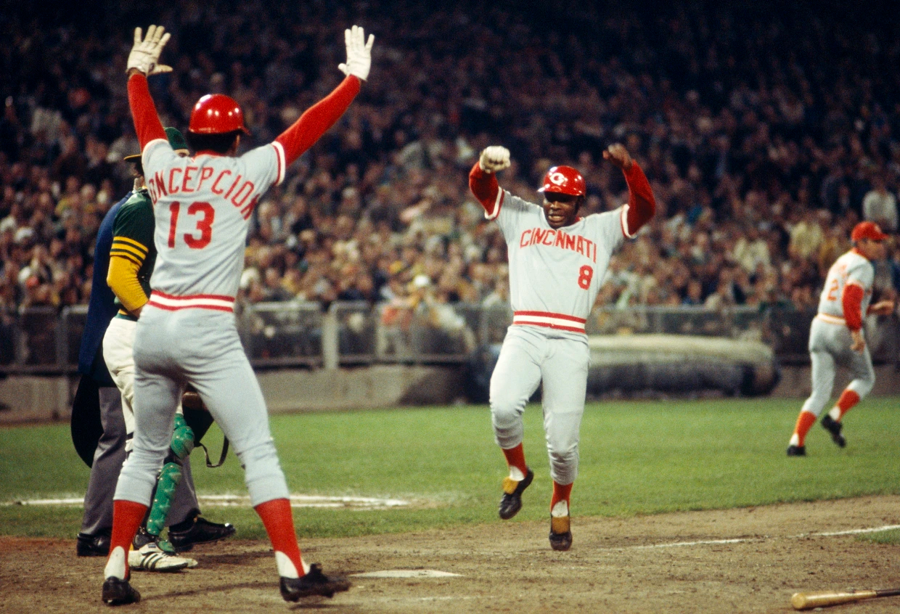

# Cincinnati Reds 2024 Hackathon - Mendoza Line



## Table of Contents
- [Introduction](#introduction)
- [Technologies Used](#technologies-used)
- [Results](#Results)
  - [Screenshots and Top Players Chosen](#screenshots-and-top-players-chosen)
  - [Usage](#usage)
  - [Code Examples & Figures](#code-examples--figures)
- [Conclusions](#conclusions)
    - [Development & Next Steps](#development--next-steps)
    - [Room for Improvement](#room-for-improvement)
- [Acknowledgements](#acknowledgements)
- [Contact](#contact)
- [License](#license)

# Introduction
## Hackathon Problem Statement 
Identify some MLB Pitchers who could be better off in a different role - perhaps as a starter, a reliever, setup guy, swingman, or something entirely different. 

Identify characteristics of pitchers that lead to their success in specific roles, such as a traditional “starting pitcher”, a traditional “relief pitcher”, or any other pitching roles that we establish with our own analysis. Using our findings, find 2-3 pitchers who can be best suited for another role and why might these role switches be better for them?

# Technologies Used
## Python Distribution
This project uses [Python 3.11.4](https://www.python.org/downloads/release/python-3114/).

## Getting Started Poetry and .venv
There are two options to get started with this project.

Option 1:

This project uses [Poetry](https://python-poetry.org/) to manage dependencies and virtual environments. To install Poetry, run the following command in your terminal:

```bash
curl -sSL https://install.python-poetry.org | python3 -
```

To install the project's dependencies, navigate to the project's root directory and run the following command:

```bash
poetry update pyproject.toml
```

Option 2:

If you do not want to use Poetry, you can activate a virtual environment and install the project's dependencies using the following commands:

```bash
source .venv/scripts/activate
pip install -r requirements.txt
```

## Streamlit
This project uses [Streamlit](https://streamlit.io/) to create the web application. Follow the link to view the custom streamlit dashboard, showing the full results of the analysis. 

[Mendoza_Line_Streamlit_Dashboard](https://share.streamlit.io/your-github-username/your-repo-name/your-app-name.py)

# Results
## Screenshots and Top Players Chosen
Include logo/screenshots/animations if available.

## Usage
How to use your project, step-by-step.

## Code Examples & Figures
Show examples of usage:
`put-your-code-here`

# Conclusions
## Development & Next Steps
Describe the development stage of your project.

## Room for Improvement
Include areas you believe need improvement / could be improved. Also add TODOs for future development.
- Improvement to be done 1
- Improvement to be done 2
- ...

## Acknowledgements
Give credit here.
- This project was inspired by...
- This project was based on [this tutorial](https://www.example.com).
- Many thanks to...

## Contact
Created by [@YourUsername](https://your-website.com/) - feel free to contact me!

## License
This project is open source and available under the [... License](LICENSE).
